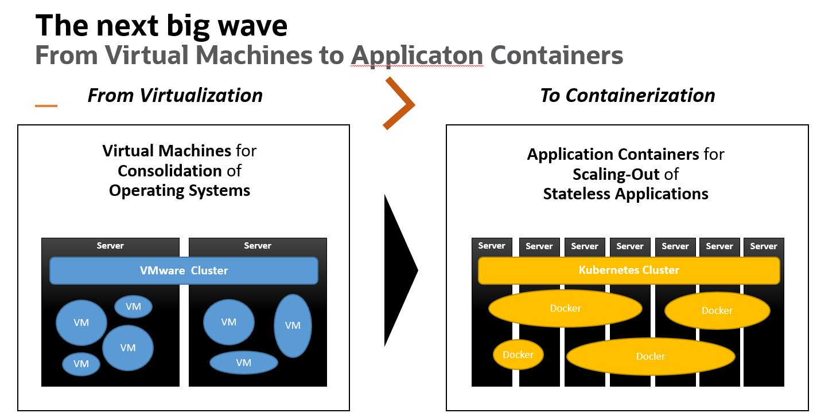
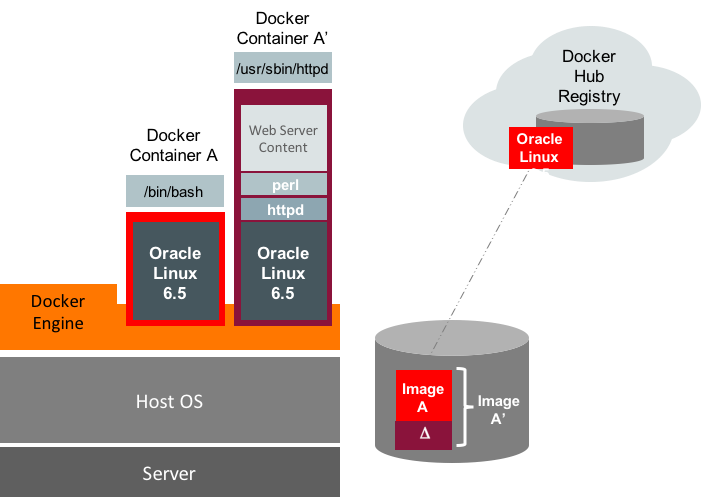
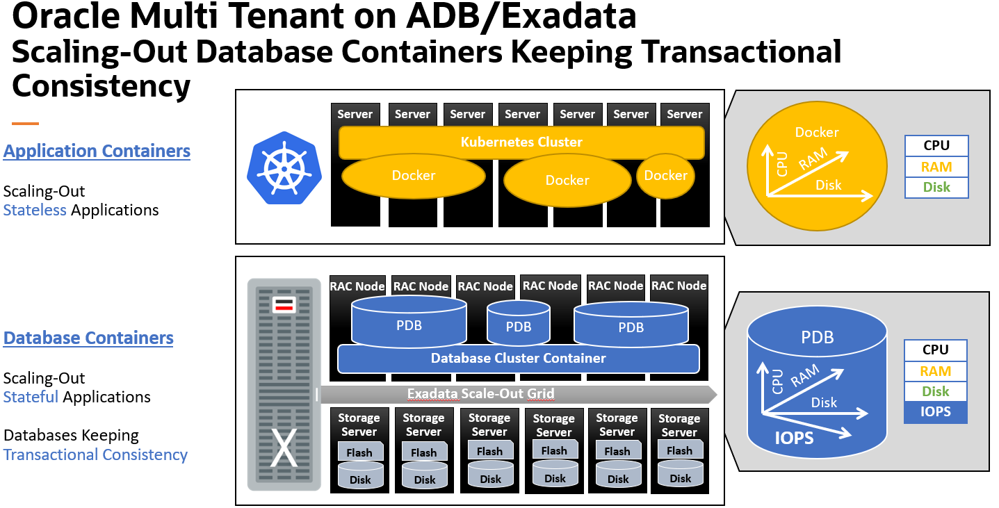

## What is Docker?

**Docker** is a software development platform for virtualization with multiple Operating systems running on the same host. It helps to separate infrastructure and applications in order to deliver software quickly. Unlike Hypervisors, which are used for creating VM (Virtual machines), virtualization in Docker is performed on system-level, also called Docker containers.

As you can see the difference in the image below, Docker containers run on top of the host's Operation system. This helps you to improves efficiency and security. Moreover, we can run more containers on the same infrastructure than we can run Virtual machines because containers use fewer resources.

[](https://www.guru99.com/images/1/101818_0504_DockerTutor1.png)

Virtualization in Docker vs Hypervisor

Unlike the VMs which can communicate with the hardware of the host (ex: Ethernet adapter to create more virtual adapters) Docker containers run in an isolated environment on top of the host's OS. Since Oracle prefers to run its products in Oracle Lunix, installing docker in Oracle Linux is preferable. You also can use Oracle slim set of libraries with each docker application to ensure you have the bacis O.S libraries that Oracle requires to run its products. ( more details in the workshop)



Q: Does that mean, we can get rid of VM's.

A: No,.We can run a VM  with docker engine installed. Since you can install multiple isolated application within each Docker container within the same VM, you might have to create fewer VM images. Also, you can scale VM  vertically to increase /decrease CPUs and  intern allow optimizing the workload on the server.

Q: Why use Docker at all !!

A:  Image you need to run a  python application and connect to a Backend database and frontend React JS application. As a developer, you will have to ensure that you install the right version of O.S, Python, and the validated version of database drivers. You have to ensure that all the backend is compatible with front end.  Next, a system administrator has to understand the installation process in development and test the install in UAT and then in production. -- There is a lot of  time and resources used to ensure that compatibility and of application, the version of libraries and underlying O.S version are all exactly the same so that you can  deploy successfully. You can say, there is some flexibility with VMs, but as mentioned earlier, they take up a lot of time and resources to test this and also susceptible to human errors. Also, You cannot control a linux server environment change over time due to adding or upgrading some libraries that could prtentally conflict with the application being run.   

Q: Why is Docker containers considered lighter than VMs.

A: A docker application depends heavily on the libraries of the O.S where its installed to do most of the work. So, in linux environments like Oracle Linux, Ubuntu, Redhat, etc, We have a set of libraries slightly different in each of them, but the underlying O.S will be the same. These different set of libraries like Oracle-slim ( 300MB in size) is what we recommend to install along with the application to run in Oracle Linux environment.  



As an example, above figure depicts a container image created on the local host by pulling an Oracle Linux 6.5 image  ( oraclelinux:6-slim) from the Docker Hub Registry. The following docker run command runs the base Oracle Linux 6.5 image as a container named ContainerA.

Now the administrator can add a layer by installing Apache web server packages and web server content. Once the container is installed and configured, the configuration can be committed generating a new Docker image named ContainerAprime.


Q : Can we have Oracle Database as a Docker Application.
A : Yes, you can. However, for production environments that needs scalability, performance, High availability, it is recommended to run the DB on a separate server and connect to the middle tier which in Docker. Unlike most of the database, Oracle Database has has scalability, performance, availability and consolidated featues of several spacalised database like JSON DB, XML DB, Graph DB, spacial and analytical DB.

Oracle pluggable database features like isolation, rapid cloning, easy upgrades compliments Applications in the middle tier.



Having mentioned that its best to keep Oracle Database outsize the application middle-tier. If the architecture requires docker for all deployments, then its recommended create just one consolidated docker image with any number of pluggable databases as required for different applications.


# Part 1: Docker for Oracle Database Applications in Node.js and Python

[Christopher Jones](https://blogs.oracle.com/author/christopher-jones)
SENIOR PRINCIPAL PRODUCT MANAGER

Welcome to this two part series on using Docker for Oracle Database applications.

- Part 1: Installing Docker and Creating Images with the Oracle Client
- [Part 2: Creating Docker containers that connect to Oracle Database](https://blogs.oracle.com/opal/docker-for-oracle-database-applications-in-nodejs-and-python-part-2)

The examples are for Node.js and Python, but the concepts are also useful for the many other languages whose database APIs are implemented on top of [Oracle Call Interface](https://www.oracle.com/pls/topic/lookup?ctx=dblatest&id=LNOCI); these other languages include C, PHP, Go, Ruby, Rust, Erlang, Julia, Nim, and Haskell.


## Installing Docker and Creating Images with the Oracle Client

### Introduction

Docker makes it easy to develop and deploy applications. In crude terms Docker is a technology allowing you to run virtual computers. It lets you build these running Docker "containers" from layers of instructions. Docker containers are becoming prevalent in application deployments, particular in a cloud world where automation is important. Docker lets you easily control that deployment.

In this post I will look at application tier, which is the most interesting piece of the architecture where automation helps greatly for frequent changes and multiple deployments. For a deeper discussion on why Docker is cool, see the Database-focused presentation [Best Practices for running Oracle Database on Docker](https://de.slideshare.net/gvenzl/oracle-database-on-docker-best-practices-92806097).

### Docker Terminology

In brief:

- docker-engine: The engine running containers
- Images: Collection of software to be run as a container
- Containers: The running VM on the host
- Registry: Place to store and download images
- Volumes: Place to persist data outside the container

### Installing the Docker Engine

The first thing needed is, of course, Docker software. If you use [Oracle Linux 7](https://linux.oracle.com/) on the host computer (where you will run Docker), then Docker can be installed easily:

```
$ sudo yum upgrade
$ sudo yum install yum-utils
$ sudo yum-config-manager --enable *addons
$ sudo yum install docker-engine
```

To use Docker you may need some optional proxy configuration, shown later. You can also decide about allowing [non-root access](https://docs.docker.com/install/linux/linux-postinstall/#manage-docker-as-a-non-root-user). Alternatively, all docker commands need to be prefixed with sudo or otherwise run as the root user.

### Pulling an Image from the Docker Registry

Now that you have Docker, you can pull an operating system Docker image from [Docker Hub](https://hub.docker.com/_/oraclelinux/). This will be the base that we add the application stack to. Most, but not all, of the Docker images in this blog post will be based on Oracle Linux. I'll also show some Debian images to indicate differences.

To get an Oracle Linux image run:

```
$ sudo docker image pull oraclelinux:7-slim
```

Once it has completed you can view the image:

```
$ sudo docker images
REPOSITORY           TAG         IMAGE ID        CREATED          SIZE
oraclelinux          7-slim      874477adb545    3 weeks ago      118MB
```

This is the Oracle Linux 7 image of reduced size, aka 'slim'. This will be the first layer of the application stack.

### Building an Oracle Instant Client Image

The standard architecture for scripting languages like Python, Node.js, PHP, Ruby, Go and other C-based languages requires Oracle client libraries to be installed. For example, with Python:


From the oraclelinux:7-slim image you can build another image that includes Oracle client libraries. For Docker, we use the free [Oracle Instant Client](https://www.oracle.com/database/technologies/instant-client.html). Applications need:

- An Instant Client 'Basic' or 'Basic Light' package for Linux 64-bit. The difference between the two is the number of character sets supported and number of error message languages. Both packages support applications that use UTF-8 (and others - refer to the Instant Client documentation). Instant Client license information is in the README and LICENSE files installed by the packages.

- The libaio package from yum needs to be installed. On Debian, get the equivalent libaio1 using apt-get.

- The system library search path needs to be configured to include the Oracle libraries, for example with:

  ```
  $ echo /opt/oracle/instantclient_19_5 > /etc/ld.so.conf.d/oic.conf
  $ ldconfig

  ```

Commands for these steps are put into a file called "Dockerfile". They are the recipe used to create an image, which can then be started (and stopped) as a running "container".

There are multiple ways that you can install Instant Client in an image.

**Instant Client Dockerfile Example 1**

The easiest way to install Instant Client is to pull it directly from yum. A Dockerfile for this is:

```
# Dockerfile using yum Instant Client RPMs

FROM oraclelinux:7-slim

RUN  yum -y install oracle-release-el7 && \
     yum -y install oracle-instantclient19.3-basiclite && \
     rm -rf /var/cache/yum
```

I'll show how to create an image from this Dockerfile a bit lower.

**Update**: New releases of Instant Client are in a different repo, see [Instant Client for Oracle Linux](https://yum.oracle.com/oracle-instant-client.html).

**Update**: Prebuilt Instant Client images are available from[ oraclelinux7-instantclient](https://github.com/orgs/oracle/packages/container/package/oraclelinux7-instantclient) and [oraclelinux8-instantclient](https://github.com/orgs/oracle/packages/container/package/oraclelinux8-instantclient). There are also images for Node.js and Python and other languages on the same [Oracle GitHub Container Registry](https://github.com/orgs/oracle/packages).

The FROM line means the Docker image to be created will be based on the Oracle Linux image we pulled previously. Then some commands will be run to install the Instant Client Basic Light package. The magic of yum package dependencies will automatically pull in libaio, as required. The Instant Client 19 RPM packages set up the library search path automatically (older versions do not), so there is no need to explicitly run ldconfig.

There are similar Dockerfiles available on [GitHub](https://github.com/oracle/docker-images/tree/master/OracleInstantClient)

**Instant Client Dockerfile Example 2**

This second method of installing Instant Client is more useful for Linux distributions, such as Ubuntu or Debian, that do not use RPM packages. Instead, Instant Client Zip files are pulled from [OTN](https://www.oracle.com/database/technologies/instant-client/linux-x86-64-downloads.html). A Dockerfile that does this is:

```
# Dockerfile using Instant Client Zips from OTN

FROM oraclelinux:7-slim

WORKDIR /opt/oracle

RUN yum install -y wget unzip libaio && \
    rm -rf /var/cache/yum
RUN wget https://download.oracle.com/otn_software/linux/instantclient/instantclient-basiclite-linuxx64.zip && \
    unzip instantclient-basiclite-linuxx64.zip && \
    rm -f instantclient-basiclite-linuxx64.zip && \
    cd instantclient* && \
    rm -f *jdbc* *occi* *mysql* *jar uidrvci genezi adrci && \
    echo /opt/oracle/instantclient* > /etc/ld.so.conf.d/oracle-instantclient.conf && \
    ldconfig
```

The WORKDIR instruction sets the working directory for RUN, COPY, ADD and similar instructions that follow it. If the WORKDIR directory doesn't exist, it will be created. Note: you should review Oracle's supported Linux distributions before choosing an OS.

**Instant Client Dockerfile Example 3**

Examples 1 and 2 can result in Instant Client packages being pulled over the network unnecessarily. You may prefer to store them locally and then add them to your Docker images. You can do this for both RPM and Zip installs.

For example, you can manually download the latest Basic Light Zip file [instantclient-basiclite-linuxx64.zip](https://download.oracle.com/otn_software/linux/instantclient/instantclient-basiclite-linuxx64.zip) from [OTN](https://www.oracle.com/database/technologies/instant-client/linux-x86-64-downloads.html). Unzip it to your computer, and remove [unnecessary files](https://docs.oracle.com/en/database/oracle/oracle-database/19/lnoci/instant-client.html#GUID-E436205F-2A39-45AC-BD28-969D4B74128B). For example, after removing unused libraries, you may have a subdirectory such as instantclient_19_5 with these files:

```
libclntshcore.so.19.1
libclntsh.so.19.1
libnnz19.so
libociicus.so
```

Then your Dockerfile can copy the files into the image:

```
# Dockerfile using extracted Instant Client Zip file on host

FROM oraclelinux:7-slim

ADD instantclient_19_5/* /opt/oracle/instantclient_19_5/

RUN yum install -y libaio && \
    rm -rf /var/cache/yum
RUN echo /opt/oracle/instantclient_19_5 > /etc/ld.so.conf.d/oic.conf && \
    ldconfig
```

Since the Zip files were used in this example, the Dockerfile has to explictly make sure libaio is installed, and also must manually configure the library search path with ldconfig.

**Building an Instant Client Image**

With any of the example Dockerfiles as ~/docker/ic19/Dockerfile, a Docker image can be built by running:

```
$ sudo docker build -t cjones/ic19 ~/docker/ic19/
```

The "-t cjones/ic19" option names the resulting image as "cjones/ic19":

```
$ sudo docker images
REPOSITORY           TAG         IMAGE ID        CREATED          SIZE
cjones/ic19          latest      8108dd0ae2a7    2 minutes ago    232MB
oraclelinux          7-slim      874477adb545    3 weeks ago      118MB
```

If you re-run the build command you will see that it completes quickly because each step of the Dockerfile is cached. If you want to force every step to be re-executed, use the --no-cache option.

If you change the Dockerfle commands and re-run the build command, a new image will be created. You may want to remove the old image:

```
$ sudo docker rmi <image id or name>
```

Or you can get rid of all dangling images with:

```
$ sudo docker image prune
```

To make sure your base images are updated, you can either manually re-pull them, or make sure each build uses the latest image:

```
$ sudo docker build --pull . . .
```

**Working Behind a Proxy**

Several [Docker options](https://docs.docker.com/network/proxy/) are useful if you are behind a proxy.

If you are always behind a proxy, you can set the Docker daemon HTTP_PROXY, HTTPS_PROXY, and NO_PROXY environment variables. For example you could set these as a systemd service on the Docker host:

```
[Service]
Environment="HTTPS_PROXY=https://proxy.example.com:80/"
```

On my laptop, which moves between networks, I generally pass parameters at build time:

```
$ sudo docker build --build-arg https_proxy=http://proxy.example.com:80 -t cjones/myname .
```

And at run time:

```
$ sudo docker run --env https_proxy=http://proxy.example.com:80 cjones/myname
```

Sometimes people put proxies directly in their Dockerfiles, however this makes the images less portable:

```
ENV https_proxy=http://proxy.example.com:80
RUN echo proxy=http://proxy.example.com:80 >> /etc/yum.conf
```

### Building a Python Docker Image

The Instant Client image can then be used to create a third image that has the desired language and database access API. Starting with an example that uses Python and the cx_Oracle driver (aka API) for Oracle Database, a Dockerfile is:

```
FROM cjones/ic19

RUN yum install -y oracle-epel-release-el7 && \
    yum install -y python36 && \
    python3.6 -m pip install cx_Oracle && \
    rm -rf /var/cache/yum
```

This installs Python 3. Other versions of Python could be used, see [Oracle Linux for Python Developers](https://yum.oracle.com/oracle-linux-python.html).

With this Dockerfile in ~/docker/python/Dockerfile, an image can be built:

```
$ sudo docker build -t cjones/python ~/docker/python/
```

We now have three images, each one adding a layer of functionality:

```
$ sudo docker images
REPOSITORY           TAG         IMAGE ID        CREATED          SIZE
cjones/python        latest      e2993fde3ec8    4 minutes ago    294MB
cjones/ic19          latest      8108dd0ae2a7    2 minutes ago    232MB
oraclelinux          7-slim      874477adb545    3 weeks ago      118MB
```

### Building a Node.js Docker Image

An image with Node.js and Instant Client can be created in a similar way to Python. As standard for Node.js applications, installing the node-oracledb driver will be done later during application installation.

**Node.js Dockerfile Example 1**

The first example Dockerfile is based on the previously created Instant Client image:

```
FROM cjones/ic19

RUN  yum -y install oracle-nodejs-release-el7 && \
     yum-config-manager --disable ol7_developer_EPEL && \
     yum -y install nodejs && \
     rm -rf /var/cache/yum
```

This has Linux, Instant Client and Node.js. If desired, the node-oracledb module could have been installed in this Dockerfile from yum, see [Node.js for Oracle Linux](https://yum.oracle.com/oracle-linux-nodejs.html).

**Node.js Dockerfile Example 2**

This Dockerfile shows an alternative way to install Node.js. It uses a [Node.js 12 image from the Docker Hub](https://hub.docker.com/_/node). Since this is a Debian-based distribution, we add Instant Client Zip files as shown earlier in "Instant Client Dockerfile Example 2":

```
FROM node:12-buster-slim

WORKDIR /opt/oracle

RUN apt-get update && \
    apt-get install -y libaio1 unzip wget
RUN wget https://download.oracle.com/otn_software/linux/instantclient/instantclient-basiclite-linuxx64.zip && \
    unzip instantclient-basiclite-linuxx64.zip && \
    rm -f instantclient-basiclite-linuxx64.zip && \
    cd instantclient* && \
    rm -f *jdbc* *occi* *mysql* *jar uidrvci genezi adrci && \
    echo /opt/oracle/instantclient* > /etc/ld.so.conf.d/oracle-instantclient.conf && \
    ldconfig
```

Note: you should review Oracle's supported Linux distributions for your Oracle version before making a decision about which to use.

**Node.js Dockerfile Example 3**

One of the other many variants for building a Node.js image is to use a multi-stage builder. Your Dockerfile could be:

```
FROM oraclelinux:7-slim as builder

ARG release=19
ARG update=5

RUN yum -y install oracle-release-el7
RUN yum -y install oracle-instantclient${release}.${update}-basiclite

RUN rm -rf /usr/lib/oracle/${release}.${update}/client64/bin
WORKDIR /usr/lib/oracle/${release}.${update}/client64/lib/
RUN rm -rf *jdbc* *occi* *mysql* *jar

# Get a new image
FROM node:12-buster-slim

# Copy the Instant Client libraries, licenses and config file from the previous image
COPY --from=builder /usr/lib/oracle /usr/lib/oracle
COPY --from=builder /usr/share/oracle /usr/share/oracle
COPY --from=builder /etc/ld.so.conf.d/oracle-instantclient.conf /etc/ld.so.conf.d/oracle-instantclient.conf

RUN apt-get update && apt-get -y upgrade && apt-get -y dist-upgrade && apt-get install -y libaio1 && \
    apt-get -y autoremove && apt-get -y clean && \
    ldconfig
```

This installs Instant Client in an OL7 image and then copies the libraries to a clean Node.js 12 image.

**Building a Node.js Image**

With one of the above dockerfiles in ~/docker/node/Dockerfile, an image can be built as:

```
$ sudo docker build -t cjones/node ~/docker/node/
```

### Running an Application Container

Now we have images with language runtimes installed, we can run an application. This example creates a new image from cjones/python. You can try similar steps with Node.js (or other language) applications. In this example we are not connecting to a database - that will come in Part 2 of this blog series.

Here's the Dockerfile:

```
FROM cjones/python

WORKDIR /myapp

ADD hi.py /myapp

CMD exec python3.6 hi.py
```

The CMD instruction gives a default command for when the container is run.

The simple Python app is:

```
# hi.py

print("Hello, World!")
```

With the Dockefile and hi.py files in ~/docker/pythonapp/, we can build an image:

```
$ sudo docker build -t cjones/pythonapp ~/docker/pythonapp/
```

and then run a container from it:

```
$ sudo docker run --name pythonapp cjones/pythonapp
Hello, World!
```

The application executed and displayed its output message. After running a container, the docker ps -a command can be used to show the status:

```
$ sudo docker ps -a
CONTAINER ID  IMAGE             COMMAND                    CREATED     STATUS                    NAMES
e9074760444  cjones/pythonapp  "/bin/sh -c 'exec py. . ."  6 secs ago  Exited (0) 2 seconds ago  pythonapp
```

With this container, since the application is not a daemon, the container simply did its work and exited. To re-run the container use:

```
$ sudo docker start -ai pythonapp
```

You can remove the container with:

```
$ sudo docker rm pythonapp
```

If you want to see what's in a container, you can start it and get shell access with:

```
$ sudo docker run --name pythonappshell -ti cjones/pythonapp /bin/bash
```

This starts a new container and puts you in the working directory. For example, you can see the python script that was installed and then stop the container:

```
bash-4.2# ls
hi.py
bash-4.2# exit
```

### A Long Running Application

What if our app is a micro service and we don't want the container to finish immediately? To show a container running as a daemon, I'll swap to using Node.js. (Yes, this still doesn't connect to a database).

Create a Dockerfile based on the cjones/node image shown earlier:

```
FROM cjones/node

WORKDIR /myapp

ADD app.js /myapp/

CMD exec node app.js
```

Also create app.js:

```
// app.js

const http = require('http');
const port = 3000;

const server = http.createServer((req, res) => {
  res.statusCode = 200;
  res.setHeader('Content-Type', 'text/plain');
  res.end('Hello World ' + new Date() + '\n');
});

server.listen(port, () => {
  console.log(`Server running on port ${port}`);
});
```

Put both files in ~/docker/nodeapp/ and build an image:

```
$ sudo docker build -t cjones/nodeapp ~/docker/nodeapp/
```

Now, a network is configured (more on networks later):

```
$ sudo docker network create oracle-net
```

We can run a container using the network, mapping port 3000 from our Docker host into port 3000 inside the container:

```
$ sudo docker run -d --name nodeapp --net oracle-net -p 3000:3000 cjones/nodeapp

$ sudo docker ps -a

CONTAINER ID  IMAGE             COMMAND                    CREATED     STATUS        NAMES
91b0e3f548fd  cjones/nodeapp    "docker-entrypoint.s. . "  6 secs ago  Up seconds    nodeapp
```

The docker ps shows the status is that the container is "Up" and running.

Load http://localhost:3000 in a browser:


Everytime you reload the web page, the current time is shown.

You can stop the container with:

```
$ sudo docker stop nodeapp
```

and restart it with:

```
$ sudo docker start nodeapp
```

If you have issues with the application, try the -ti option to see what went wrong:

```
$ sudo docker run -ti --name nodeapp --net oracle-net -p 3000:3000 cjones/nodeapp
```

Other useful troubleshooting commands that can be used are:

```
$ sudo docker logs nodeapp -f
```

and, on a running container, this gives you shell access:

```
$ sudo docker exec -ti nodeapp /bin/bash
```

### Conclusion to Part 1

Part 1 of this series has introduced Docker and shown how to create containers and run simple applications. In [Part 2](https://blogs.oracle.com/opal/docker-for-oracle-database-applications-in-nodejs-and-python-part-2) we'll see how to connect applications to a database, and learn some application best practices.

#### Join th
